# Testing

> [!NOTE]  
> Return back to the [README.md](README.md) file.

## Code Validation

### Python

I have used the recommended [PEP8 CI Python Linter](https://pep8ci.herokuapp.com) to validate all of my Python files.

I had 238 issues, most of the issues were repetitive as I scroll down to all the issue, their were only six issues and they were
- E302 expected 2 blank lines, found 1
    - Solve the issue by adding another blank line
- W293 blank line contains whitespace
    - Solve the issue by removing the whitespace in the blank line
- E501 line too long (93 > 79 characters)
    - Solve the issue by removing the long line
- W291 trailing whitespace
    - Solve the issue by removing trailing white space
- E225 missing whitespace around operator
    - Solve the issue by adding whitespace 
- E305 expected 2 blank lines after class or function definition, found 1
    - Solve the issue by adding another blank line
- W292 no newline at end of file
    - Solve the issue by adding blank line after the end of the file

| File | CI URL | Screenshot | Notes |
| --- | --- | --- | --- |
| run.py | [PEP8 CI](https://pep8ci.herokuapp.com/https://raw.githubusercontent.com/AlanSmythDeaf/healthireland/main/run.py) | 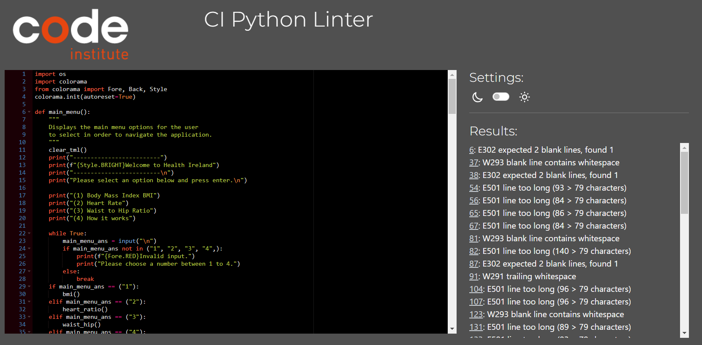 | Issue with blank line, blank line containing white space, line too long |
| run.py | [PEP8 CI](https://pep8ci.herokuapp.com/https://raw.githubusercontent.com/AlanSmythDeaf/healthireland/main/run.py) | 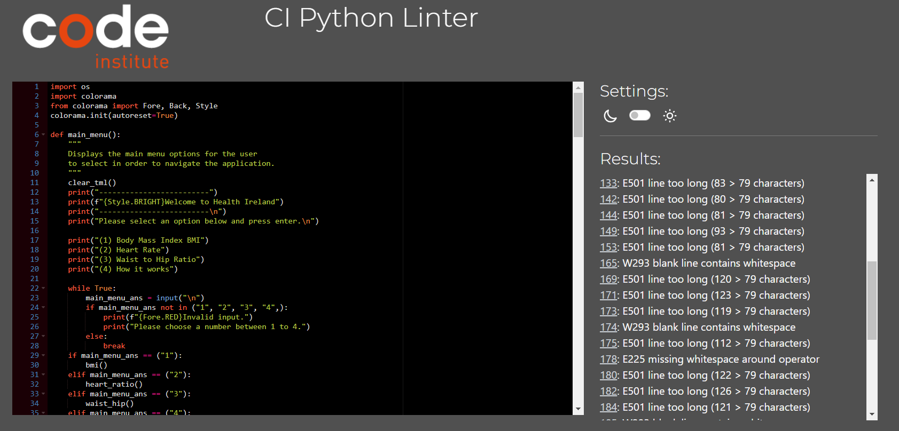 | Issue with line too long, blank line contains whitespace, missing whitespace around operator
| run.py | [PEP8 CI](https://pep8ci.herokuapp.com/https://raw.githubusercontent.com/AlanSmythDeaf/healthireland/main/run.py) | 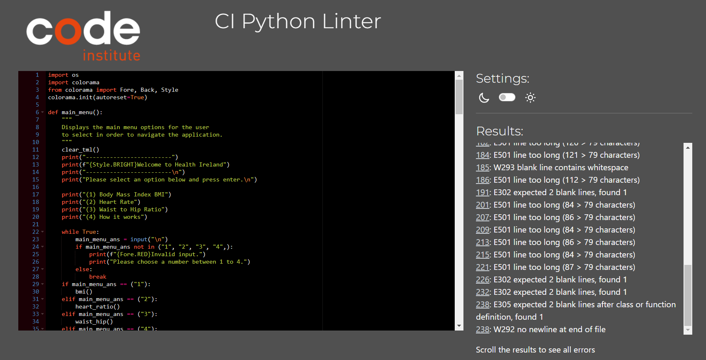 | Issue with line too long, blank line contains whitespace, two blank lines|
| run.py | [PEP8 CI](https://pep8ci.herokuapp.com/https://raw.githubusercontent.com/AlanSmythDeaf/healthireland/main/run.py) | 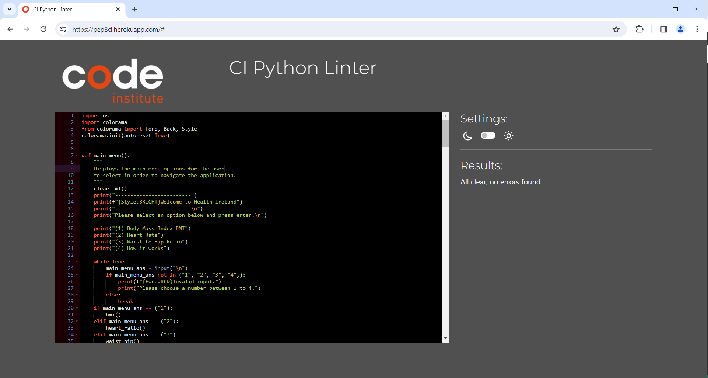 | All clear, no errors found |

## Browser Compatibility

I've tested my deployed project on multiple browsers to check for compatibility issues.

| Browser | Home | Notes |
| --- | --- | --- |
| Chrome | 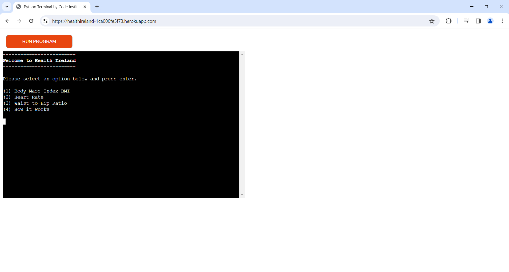 | Works Fine  |
| Firefox | 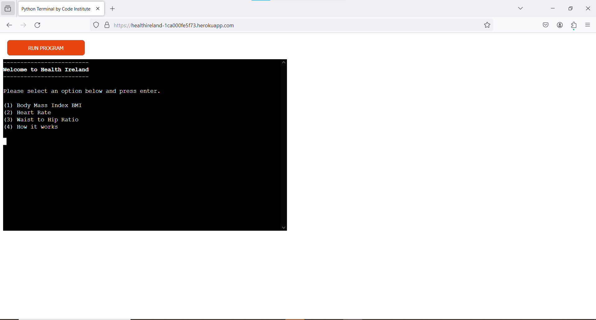 | Works Fine  |
| Edge | 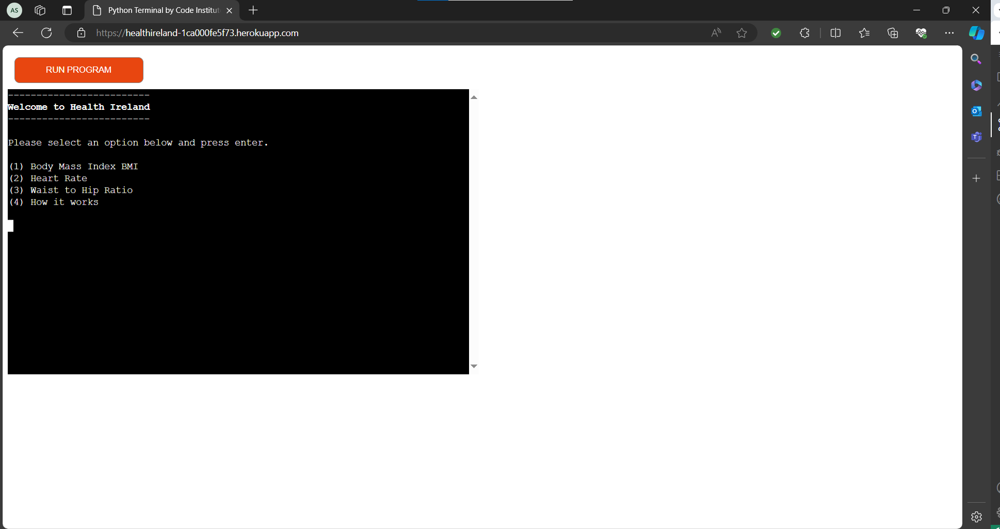 | Works Fine  |

## Defensive Programming

Defensive programming was manually tested with the below user acceptance testing:

| Page | Expectation | Test | Result | Fix | Screenshot |
| --- | --- | --- | --- | --- | --- |
| Main Menu | | | | | |
| | When I type an number that is outside 1-4 and type in a letter, I expect an error. | Test | Result | Test concluded and passed | 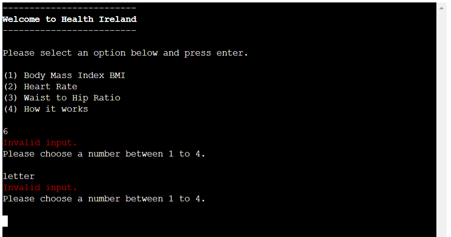 |
| | When chose number one, expect go to bmi section | Test | Result | Test concluded and passed | 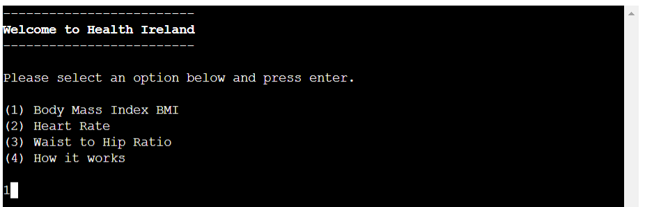 |
| | When chose number two, expect go to heart section | Test | Result | Test concluded and passed | 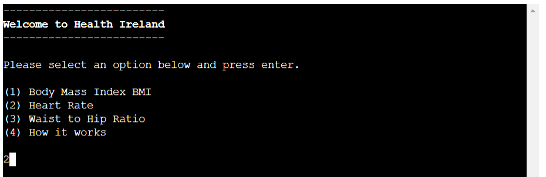 |
| | When chose number three, expect go to waist to hip section | Test | Result | Test concluded and passed |  |
| | When chose number four, expect go to how it works section | Test | Result | Test concluded and passed | 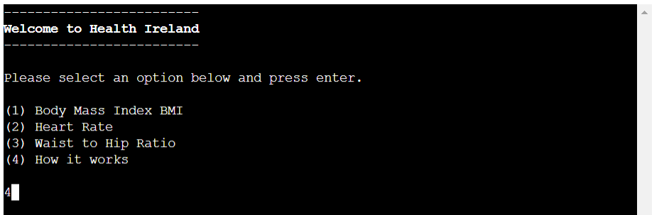 |
| Body Mass Index | | | | | |
| | In the bmi section, for the height part when I type in a number, letter or outside 1.00 to 2.44 I expect an error. | Test | Result | Test concluded and passed | 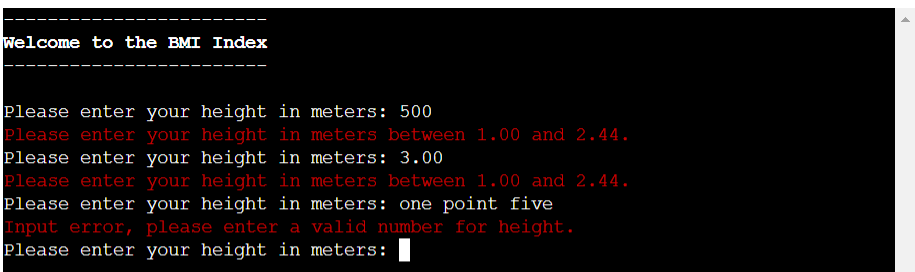 |
| | When type in the correct number between 1.00 to 2.44, I expect it will ask for for weight | Test concluded and passed | Result | Test concluded and passed | 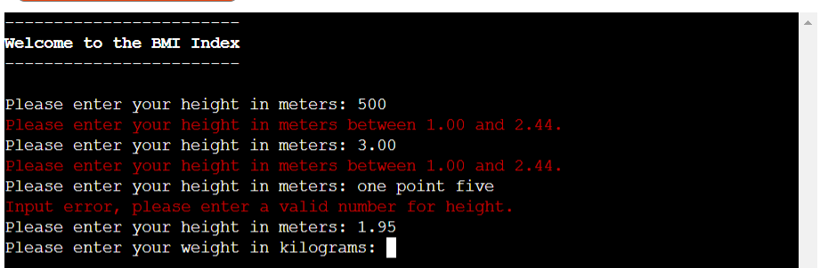 |
| | For the weight part when I type in a number outside 35 to 199 or an letter I expect an error. | Test | Result | Test concluded and passed |  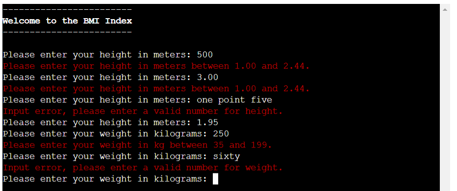 |
| | When the input for weight is correct I expect to display the bmi result | Test | Result | Test concluded and passed | 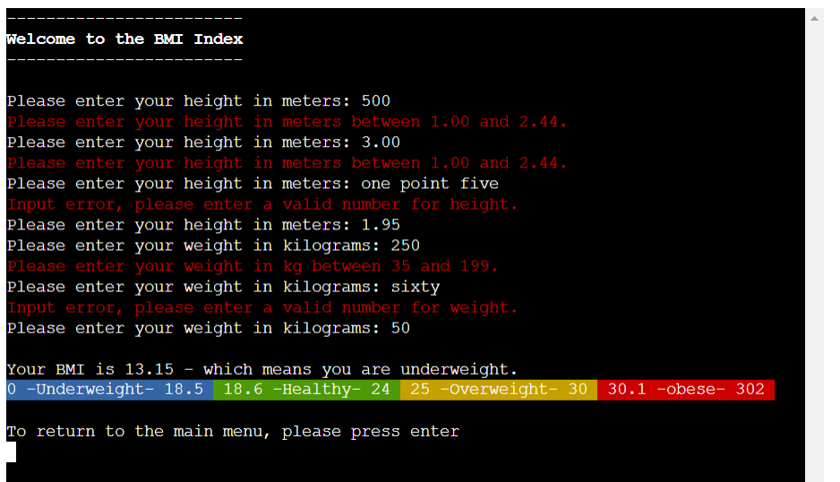
| | When pressing letter or number I expect it not to affect when pressing enter, when pressing enter while it's blank expect to return to main menu | Test | Result | Test concluded and passed | 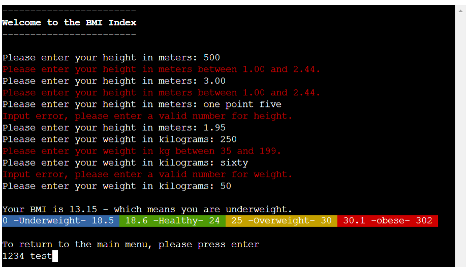 |
| Heart Ratio | | | | | |
| | In the heart section, when I type in a number that is outside between 1 to 100 or a letter I expect an error. | Test | Result | Test concluded and passed | 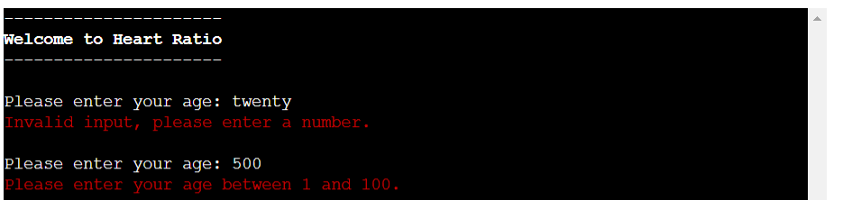 |
| | When type in the correct number between 10 to 100, I expect to give me the result | Test | Result | Test concluded and passed | 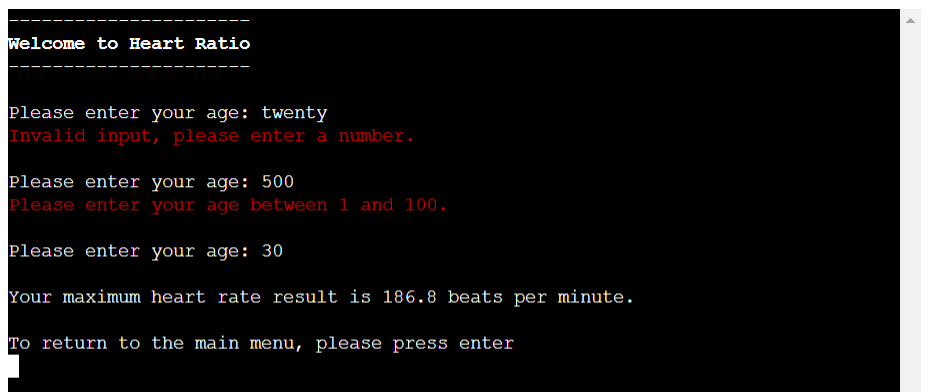 |
| | When pressing letter or number I expect it not to affect when pressing enter, when pressing enter while it's blank expect to return to main menu | Test | Result | Test concluded and passed | 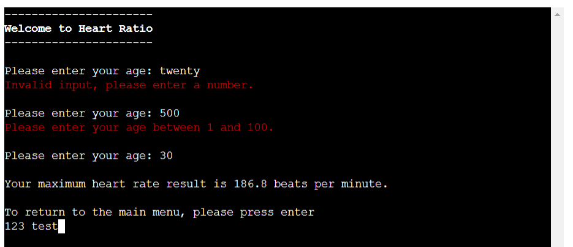 |
| Waist to Hip Ratio | | | | | |
| | In the waist to hip section, for the waist part when I type in a letter or number outside 50 to 300 I expect an error. | Test | Result | Test concluded and passed | 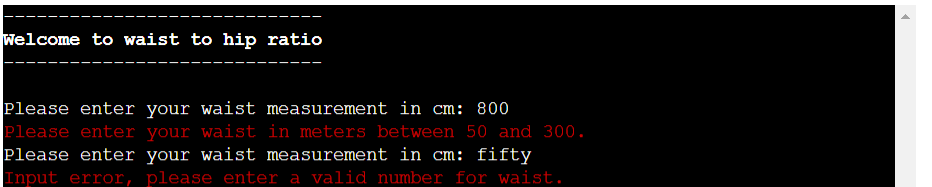 |
| | When I put in the correct number, between 50 to 300 I expect to it to be correct and ask for hip measurement | Test | Result | Test concluded and passed | 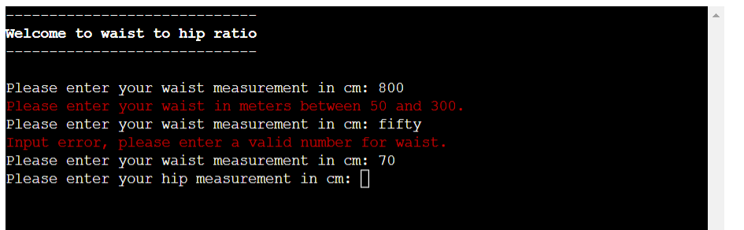 |
| | In the hip part when I type in a letter or number outside 50 to 300 I expect an error. | Test | Result | Test concluded and passed | 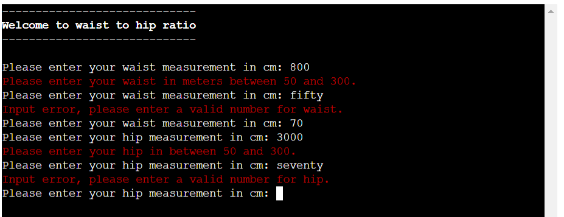 |
| | When I put in the correct number, between 50 to 300 I expect to it to be correct and ask for gender male or female | Test | Result | Test concluded and passed | 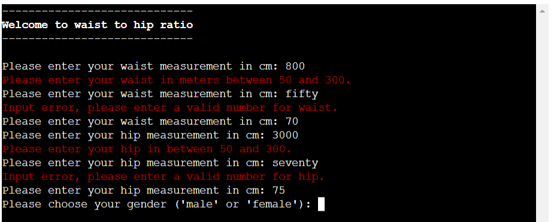 |
| | In the gender part when I type in a letter or number expect an error. | Test | Result | Test concluded and passed | 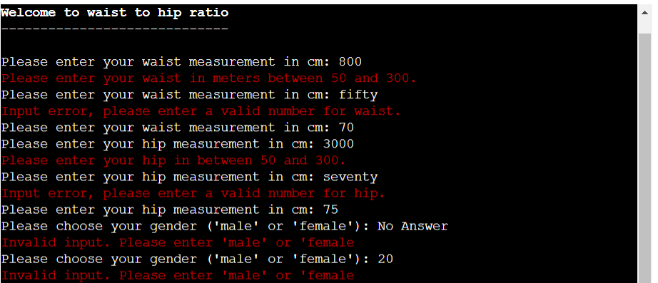 |
| | When I enter male or female I expect an result for the waist to hip | Test | Result | Test concluded and passed | 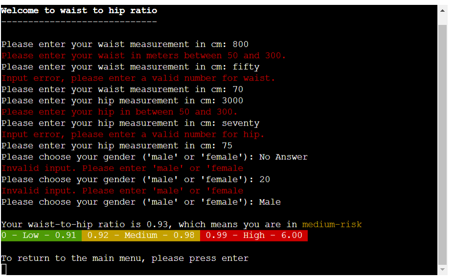 |
| | When pressing letter or number I expect it not to affect when pressing enter, when pressing enter while it's blank expect to return to main menu | Test | Result | Test concluded and passed | 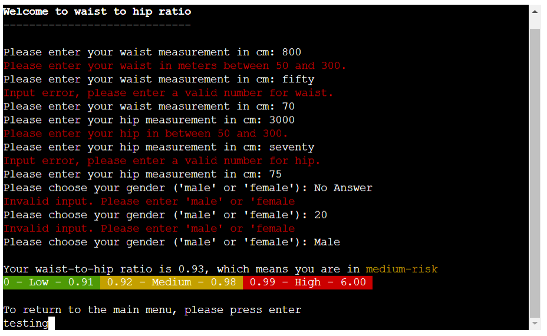 |
| How it works | | | | | |
| | Expect it to display the information on how the Health Ireland works and when pressing letter or number i expect not to affect when pressing enter, when pressing enter while it's blank expect to return to main menu | Test | Result | Test concluded and passed |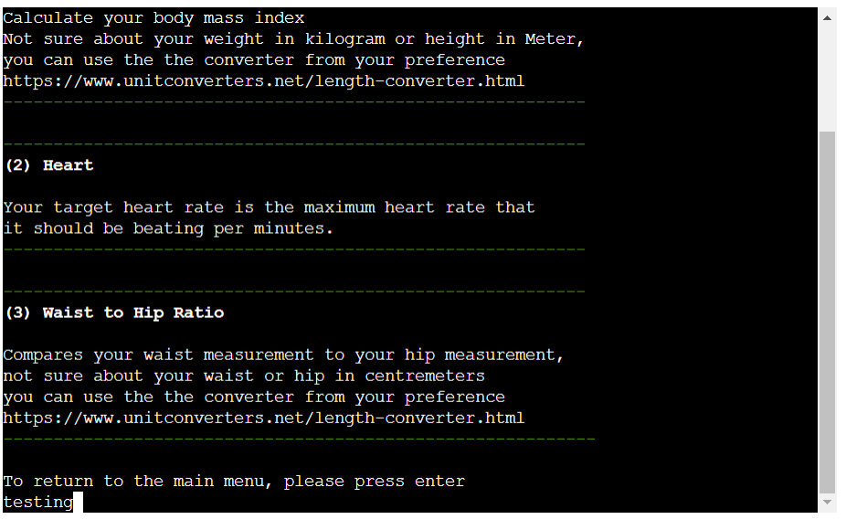 |

## Bugs

## Unfixed Bugs
> [!NOTE]  
> There are no remaining bugs that I am aware of.
